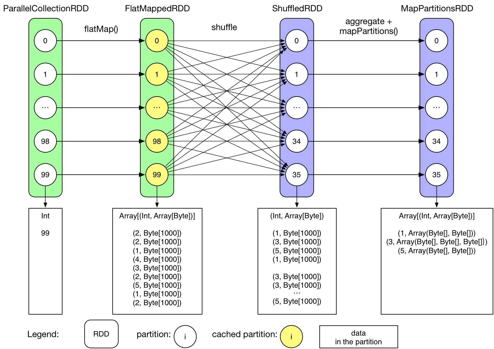

## ภาพรวมของ Apache Spark

เริ่มแรกเราจะให้ความสนใจไปที่ระบบดีพลอยของ Spark คำถามก็คือ : **ถ้าดีพลอยเสร็จเรียบร้อยแล้วระบบของแต่ละโหนดในคลัสเตอร์ทำงานอะไรบ้าง?**

## Deployment Diagram


จากแผนภาพการดีพลอย :		
	- โหนด Master และโหนด Worker ในคลัสเตอร์ มีหน้าที่เหมือนกับโหนด Master และ Slave ของ Hadoop		
	- โหนด Master จะมีโปรเซส Master ที่ทำงานอยู่เบื้องหลังเพื่อที่จะจัดการโหนด Worker ทุกตัว		
	- โหนด Worker จะมีโปรเซส Worker ทำงานอยู่เบื้องหลังซึ่งรับผิดชอบการติดต่อกับโหนด Master และจัดการกับ Executer ภายในตัวโหนดของมันเอง		
	- Driver ในเอกสารที่เป็นทางการอธิบายว่า "The process running the main() function of the application and creating the SparkContext" ไดรว์เวอร์คือโปรเซสที่กำลังทำงานฟังก์ชั่น main() ซึ่งเป็นฟังก์ชันที่เอาไว้เริ่มต้นการทำงานของแอพพลิเคชันของเราและสร้าง SparkContext ซึ่งจะเป็นสภาพแวดล้อมที่แอพพลิเคชันจะใช้ทำงานร่วมกัน และแอพพลิเคชันก็คือโปรแกรมของผู้ใช้ที่ต้องให้ประมวลผล บางทีเราจะเรียกว่าโปรแกรมไดรว์เวอร์ (Driver program) เช่น WordCount.scala เป็นต้น หากโปรแกรมไดรเวอร์กำลังทำงานอยู่บนโหนด Master ยกตัวอย่าง	

```scala
./bin/run-example SparkPi 10
```	

จากโค้ดด้านบนแอพพลิเคชัน SparkPi สามารถเป็นโปรแกรมไดรว์เวอร์สำหรับโหนด Master ได้ ในกรณีของ YARN (ตัวจัดการคลัสเตอร์ตัวหนึ่ง) ไดรว์เวอร์อาจจะถูกสั่งให้ทำงานที่โหนด Worker ได้ ซึ่งถ้าดูตามแผนภาพด้านบนมันเอาไปไว้ที่โหนด Worker 2 และถ้าโปรแกรมไดรเวอร์ถูกสร้างภายในเครื่องเรา เช่น การใช้ Eclipse หรือ IntelliJ บนเครื่องของเราเองตัวโปรแกรมไดรว์เวอร์ก็จะอยู่ในเครื่องเรา พูดง่ายๆคือไดรว์เวอร์มันเปลี่ยนที่อยู่ได้

```scala
val sc = new SparkContext("spark://master:7077", "AppName")
```

แม้เราจะชี้ตัว SparkContext ไปที่โหนด Master แล้วก็ตามแต่ถ้าโปรแกรมทำงานบนเครื่องเราตัวไดรว์เวอร์ก้ยังจะอยู่บนเครื่องเรา อย่างไรก็ดีวิธีนี้ไม่แนะนำให้ทำถ้าหากเน็ตเวิร์คอยู่คนละวงกับ Worker เนื่องจากจะทำใหการสื่อสารระหว่าง Driver กับ Executor ช้าลงอย่างมาก มีข้อควรรู้บางอย่างดังนี้

  - เราสามารถมี ExecutorBackend ได้ตั้งแต่ 1 ตัวหรือหลายตัวในแต่ละโหนด Worker และตัว ExecutorBackend หนึ่งตัวจะมี Executor หนึ่งตัว แต่ละ Executor จะดูแล Thread pool และ Task ซึ่งเป็นงานย่อยๆ โดยที่แต่ละ Task จะทำงานบน Thread ตัวเดียว
  - แต่ละแอพพลิเคชันมีไดรว์เวอร์ได้แค่ตัวเดียวแต่สามารถมี Executor ได้หลายตัว, และ Task ทุกตัวที่อยู่ใน Executor เดียวกันจะเป็นของแอพพลิเคชันตัวเดียวกัน
  - ในโหมด Standalone, ExecutorBackend เป็นอินสแตนท์ของ CoarseGrainedExecutorBackend

    > คลัสเตอร์ของผู้เขียนมีแค่ CoarseGrainedExecutorBackend ตัวเดียวบนแต่ละโหนด Worker ผู้เขียนคิดว่าหากมีหลายแอพพลิเคชันรันอยู่มันก็จะมีหลาย CoarseGrainedExecutorBackend แต่ไม่ฟันธงนะ
    
    > อ่านเพิ่มในบล๊อค (ภาษาจีน) [Summary on Spark Executor Driver Resource Scheduling](http://blog.csdn.net/oopsoom/article/details/38763985) เขียนโดย [@OopsOutOfMemory](http://weibo.com/oopsoom) ถ้าอยากรู้เพิ่มเติมเกี่ยวกับ Worker และ Executor

  - โหนด Worker จะควบคุม CoarseGrainedExecutorBackend ผ่านทาง ExecutorRunner

หลังจากดูแผนภาพการดีพลอยแล้วเราจะมาทดลองสร้างตัวอย่างของ Spark job เพื่อดูว่า Spark job มันถูกสร้างและประมวลผลยังไง

## ตัวอย่างของ Spark Job
ตัวอย่างนี้เป็นตัวอย่างการใช้งานแอพพลิเคชันที่ชื่อ GroupByTest ภายใต้แพ็กเกจที่ติดมากับ Spark ซึ่งเราจะสมมุติว่าแอพพลิเคชันนี้ทำงานอยู่บนโหนด Master โดยมีคำสั่งดังนี้

```scala
/* Usage: GroupByTest [numMappers] [numKVPairs] [valSize] [numReducers] */

bin/run-example GroupByTest 100 10000 1000 36
```

โค้ดที่อยู่ในแอพพลิเคชันมีดังนี้

```scala
package org.apache.spark.examples

import java.util.Random

import org.apache.spark.{SparkConf, SparkContext}
import org.apache.spark.SparkContext._

/**
  * Usage: GroupByTest [numMappers] [numKVPairs] [valSize] [numReducers]
  */
object GroupByTest {
  def main(args: Array[String]) {
    val sparkConf = new SparkConf().setAppName("GroupBy Test")
    var numMappers = 100
    var numKVPairs = 10000
    var valSize = 1000
    var numReducers = 36

    val sc = new SparkContext(sparkConf)

    val pairs1 = sc.parallelize(0 until numMappers, numMappers).flatMap { p =>
      val ranGen = new Random
      var arr1 = new Array[(Int, Array[Byte])](numKVPairs)
      for (i <- 0 until numKVPairs) {
        val byteArr = new Array[Byte](valSize)
        ranGen.nextBytes(byteArr)
        arr1(i) = (ranGen.nextInt(Int.MaxValue), byteArr)
      }
      arr1
    }.cache
    // Enforce that everything has been calculated and in cache
println(">>>>>>")
    println(pairs1.count)
println("<<<<<<")
    println(pairs1.groupByKey(numReducers).count)

    sc.stop()
  }
}

```

หลังจากที่อ่านโค้ดแล้วจะพบว่าโค้ดนี้มีแนวความคิดในการแปลงข้อมูลดังนี้


แอพพลิเคชันนี้ไม่ได้ซับซ้อนอะไรมาก เราจะประเมินขนาดของข้อมูลและผลลัพธ์ซึ่งแอพพลิเคชันก็จะมีการทำงานตามขั้นตอนดังนี้

  1. สร้าง SparkConf เพื่อกำหนดการตั้งค่าของ Spark (ตัวอย่างกำหนดชื่อของแอพพลิเคชัน)
  2. สร้างและกำหนดค่า numMappers=100, numKVPairs=10,000, valSize=1000, numReducers= 36
  3. สร้าง SparkContext โดยใช้การตั้งค่าจาก SparkConf ขั้นตอนนี้สำคัญมากเพราะ SparkContext จะมี Object และ Actor ซึ่งจำเป็นสำหรับการสร้างไดรว์เวอร์
  4. สำหรับ Mapper แต่ละตัว `arr1: Array[(Int, Byte[])]` Array ชื่อ arr1 จะถูกสร้างขึ้นจำนวน numKVPairs ตัว, ภายใน Array แต่ละตัวมีคู่ Key/Value ซึ่ง Key เป็นตัวเลข (ขนาด 4 ไบต์) และ Value เป็นไบต์ขนาดเท่ากับ valSize อยู่ ทำให้เราประเมินได้ว่า `ขนาดของ arr1 = numKVPairs * (4 + valSize) = 10MB`, ดังนั้นจะได้ว่า `ขนาดของ pairs1 = numMappers * ขนาดของ arr1 ＝1000MB` ตัวนี้ใช้เป็นการประเมินการใช้พื้นที่จัดเก็บข้อมูลได้
  5. Mapper แต่ละตัวจะ**ถูกสั่งให้ Cache** ตัว `arr1` (ผ่านทาง pairs1) เพื่อเก็บมันไว้ในหน่วยความจำเผื่อกรณีที่มีการเรียกใช้ (ยังไม่ได้ทำนะแต่สั่งใว้)
  6. จากนั้นจะมีการกระทำ count() เพื่อคำนวณหาขนาดของ `arr1` สำหรับ Mapper ทุกๆตัวซึ่งผลลัพธ์จะเท่ากับ `numMappers * numKVPairs = 1,000,000` การกระทำในขั้นตอนนี้ทำให้เกิดการ Cahce ที่ตัว `arr1` เกิดขึ้นจริงๆ (จากคำสั่ง `pairs1.count()1` ตัวนี้จะมีสมาชิก 1,000,000 ตัว)
  7. groupByKey ถูกสั่งให้ทำงานบน `pairs1` ซึ่งเคยถูก Cache เก็บไว้แล้ว โดยจำนวนของ Reducer (หรือจำนวนพาร์ทิชัน) ถูกกำหนดในตัวแปร numReducers ในทางทฤษฏีแล้วถ้าค่า Hash ของ Key มีการกระจายอย่างเท่าเทียมกันแล้วจะได้ `numMappers * numKVPairs / numReducer ＝ 27,777` ก็คือแต่ละตัวของ Reducer จะมีคู่ (Int, Array[Byte]) 27,777 คู่อยู่ในแต่ละ Reducer ซึ่งจะมีขนาดเท่ากับ `ขนาดของ pairs1 / numReducer = 27MB`
  8. Reducer จะรวบรวมเรคคอร์ดหรือคู่ Key/Value ที่มีค่า Key เหมือนกันเข้าไว้ด้วยกันกลายเป็น Key เดียวแล้วก็ List ของ Byte `(Int, List(Byte[], Byte[], ..., Byte[]))`
  9. ในขั้นตอนสุดท้ายการกระทำ count() จะนับหาผลรวมของจำนวนที่เกิดจากแต่ละ Reducer ซึ่งผ่านขั้นตอนการ groupByKey มาแล้ว (ทำให้ค่าอาจจะไม่ได้ 1,000,000 พอดีเป๊ะเพราะว่ามันถูกจับกลุ่มค่าที่ Key เหมือนกันซึ่งเป็นการสุ่มค่ามาและค่าที่ได้จากการสุ่มอาจจะตรงกันพอดีเข้าไว้ด้วยกันแล้ว) สุดท้ายแล้วการกระทำ count() จะรวมผลลัพธ์ที่ได้จากแต่ละ Reducer เข้าไว้ด้วยกันอีกทีเมื่อทำงานเสร็จแล้วก็จะได้จำนวนของ Key ที่ไม่ซ้ำกันใน `paris1`

## แผนเชิงตรรกะ Logical Plan

ในความเป็นจริงแล้วกระบวนการประมวลผลของแอพพลิเคชันของ Spark นั้นซับซ้อนกว่าที่แผนภาพด้านบนอธิบายไว้ ถ้าจะว่าง่ายๆ แผนเชิงตรรกะ Logical Plan (หรือ data dependency graph - DAG) จะถูกสร้างแล้วแผนเชิงกายภาพ Physical Plan ก็จะถูกผลิตขึ้น (English : a logical plan (or data dependency graph) will be created, then a physical plan (in the form of a DAG) will be generated เป็นการเล่นคำประมาณว่า Logical plan มันถูกสร้างขึ้นมาจากของที่ยังไม่มีอะไร Physical plan ในรูปของ DAG จาก Logical pan นั่นแหละ จะถูกผลิตขึ้น) หลังจากขั้นตอนการวางแผนทั้งหลายแหล่นี้แล้ว Task จะถูกผลิตแล้วก็ทำงาน เดี๋ยวเราลองมาดู Logical plan ของแอพพลิเคชันดีกว่า

ตัวนี้เรียกใช้ฟังก์ชัน `RDD.toDebugString` แล้วมันจะคืนค่า Logical Plan กลับมา:

```scala
  MapPartitionsRDD[3] at groupByKey at GroupByTest.scala:51 (36 partitions)
    ShuffledRDD[2] at groupByKey at GroupByTest.scala:51 (36 partitions)
      FlatMappedRDD[1] at flatMap at GroupByTest.scala:38 (100 partitions)
        ParallelCollectionRDD[0] at parallelize at GroupByTest.scala:38 (100 partitions)
```

วาดเป็นแผนภาพได้ตามนี้:


> ข้อควรทราบ `data in the partition` เป็นส่วนที่เอาไว้แสดงค่าว่าสุดท้ายแล้วแต่ละพาร์ทิชันมีค่ามีค่ายังไง แต่มันไม่ได้หมายความว่าข้อมูลทุกตัวจะต้องอยู่ในหน่วยความจำในเวลาเดียวกัน

ดังนั้นเราขอสรุปดังนี้:		
  - ผู้ใช้จะกำหนดค่าเริ่มต้นให้ข้อมูลมีค่าเป็น Array จาก 0 ถึง 99 จากคำสั่ง `0 until numMappers` จะได้จำนวน 100 ตัว		
  - parallelize() จะสร้าง ParallelCollectionRDD แต่ละพาร์ทิชันก็จะมีจำนวนเต็ม i			
  - FlatMappedRDD จะถูกผลิตโดยการเรียกใช้ flatMap ซึ่งเป็นเมธอตการแปลงบน ParallelCollectionRDD จากขั้นตอนก่อนหน้า ซึ่งจะให้ FlatMappedRDD ออกมาในลักษณะ `Array[(Int, Array[Byte])]`		
  - หลังจากการกระทำ count() ระบบก็จะทำการนับสมาชิกที่อยู่ในแต่ละพาร์ทิชันของใครของมัน เมื่อนับเสร็จแล้วผลลัพธ์ก็จะถูกส่งกลับไปรวมที่ไดรว์เวอร์เพื่อที่จะได้ผลลัพธ์สุดท้ายออกมา 		
  - เนื่องจาก FlatMappedRDD ถูกเรียกคำสั่ง Cache เพื่อแคชข้อมูลไว้ในหน่วยความจำ จึงใช้สีเหลืองให้รู้ว่ามีความแตกต่างกันอยู่นะ		
  - groupByKey() จะผลิต 2 RDD (ShuffledRDD และ MapPartitionsRDD) เราจะคุยเรื่องนี้กันในบทถัดไป		
  - บ่อยครั้งที่เราจะเห็น ShuffleRDD เกิดขึ้นเพราะงานต้องการการสับเปลี่ยน ลักษณะความสัมพันธ์ของตัว ShuffleRDD กับ RDD ที่ให้กำเนิดมันจะเป็นลักษณะเดียวกันกับ เอาท์พุทของ Mapper ที่สัมพันธ์กับ Input ของ Reducer ใน Hadoop		
  - MapPartitionRDD เก็บผลลัพธ์ของ groupByKey() เอาไว้		
  - ค่า Value ของ MapPartitionRDD (`Array[Byte]`) จำถูกแปลงเป็น `Iterable`		
  - ตัวการกระทำ count() ก็จะทำเหมือนกับที่อธิบายไว้ด้านบน
  
**เราจะเห็นได้ว่าแผนเชิงตรรกะอธิบายการไหลของข้อมูลในแอพพลิเคชัน: การแปลง (Transformation) จะถูกนำไปใช้กับข้อมูล, RDD ระหว่างทาง (Intermediate RDD) และความขึ้นต่อกันของพวก RDD เหล่านั้น**

## แผนเชิงกายภาพ Physical Plan

ในจุดนี้เราจะชี้ให้เห็นว่าแผนเชิงตรรกะ Logical plan นั้นเกี่ยวข้องกับการขึ้นต่อกันของข้อมูลแต่มันไม่ใช่งานจริงหรือ Task ที่เกิดการประมวลผลในระบบ ซึ่งจุดนี้ก็เป็นอีกหนึ่งจุดหลักที่ทำให้ Spark ต่างกับ Hadoop, ใน Hadoop ผู้ใช้จะจัดการกับงานที่กระทำในระดับกายภาพ (Physical task) โดยตรง: Mapper tasks จะถูกนำไปใช้สำหรับดำเนินการ (Operations) บนพาร์ทิชัน จากนั้น Reduce task จะทำหน้าที่รวบรวมกลับมา แต่ทั้งนี้เนื่องจากว่าการทำ MapReduce บน Hadoop นั้นเป็นลักษณะที่กำหนดการไหลของข้อมูลไว้ล่วงหน้าแล้วผู้ใช้แค่เติมส่วนของฟังก์ชัน `map()` และ `reduce()` ในขณะที่ Spark นั้นค่อนข้างยืดหยุ่นและซับซ้อนมากกว่า ดังนั้นมันจึงยากที่จะรวมแนวคิดเรื่องความขึ้นต่อกันของข้อมูลและงานทางกายภาพเข้าไว้ด้วยกัน เหตุผลก็คือ Spark แยกการไหลของข้อมูลและงานที่จะถูกประมวลผลจริง, และอัลกอริทึมของการแปลงจาก Logical plan ไป Physical plan ซึ่งเราจะคุยเรื่องนี้ันต่อในบทถัดๆไป

ยกตัวอย่างเราสามารถเขียนแผนเชิงกายภาพของ DAG ดังนี้:


เราจะเห็นว่าแอพพลิเคชัน GroupByTest สามารถสร้างงาน 2 งาน งานแรกจะถูกกระตุ้นให้ทำงานโดยคำสั่ง `pairs1.count()` มาดูรายละเอียดของ Job นี้กัน:

  - Job จะมีเพียง Stage เดียว (เดี๋ยวเราก็จะคุยเรื่องของ Stage กันทีหลัง) 
  - Stage 0 มี 100 ResultTask
  - แต่ละ Task จะประมวลผล flatMap ซึ่งจะสร้าง FlatMappedRDD แล้วจะทำ `count()` เพื่อนับจำนวนสมาชิกในแต่ละพาร์ทิชัน ยกตัวอย่างในพาร์ทิชันที่ 99 มันมีแค่ 9 เรคอร์ด
  - เนื่องจาก `pairs1` ถูกสั่งให้แคชดังนั้น Tasks จะถูกแคชในรูปแบบพาร์ทิชันของ FlatMappedRDD ภายในหน่วยความจำของตัว Executor
  - หลังจากที่ Task ถูกทำงานแล้วไดรว์เวอร์จะเก็บผลลัพธ์มันกลับมาเพื่อบวกหาผลลัพธ์สุดท้าย 
  - Job 0 ประมวลผลเสร็จเรียบร้อย

ส่วน Job ที่สองจะถูกกระตุ้นให้ทำงานโดยการกระทำ `pairs1.groupByKey(numReducers).count`:

  - มี 2 Stage ใน Job
  - Stage 0 จะมี 100 ShuffleMapTask แต่ละ Task จะอ่านส่วนของ `paris1` จากแคชแล้วพาร์ทิชันมันแล้วก็เขียนผลลัพธ์ของพาร์ทิชันไปยังโลคอลดิสก์ ยกตัวอย่าง Task ที่มีเรคอร์ดลักษณะคีย์เดียวกันเช่น Key 1 จาก Value เป็น Byte ก็จะกลายเป็นตระกร้าของ Key 1 เช่น `(1, Array(...))` จากนั้นก็ค่อยเก็บลงดิสก์ ซึ่งขั้นตอนนี้ก็จะคล้ายกับการพาร์ทิชันของ Mapper ใน Hadoop
  - Stage 1 มี 36 ResultTask แต่ละ Task ก็จะดึงและสับเปลี่ยนข้อมูลที่ต้องการจะประมวลผล ในขณะที่อยู่ขั้นตอนของการดึงข้อมูลและทำงานคำสั่ง mapPartitions() ก็จะเกิดการรวบรวมข้อมูลไปด้วย ถัดจากนั้น count() จะถูกเรียกใช้เพื่อให้ได้ผลลัพธ์ ตัวอย่างเช่น สำหรับ ResultTask ที่รับผิดชอบกระกร้าของ 3 ก็จะดึงข้อมูลทุกตัวที่มี Key 3 จาก Worker เข้ามารวมไว้ด้วยกันจากนั้นก็จะรวบรวมภายในโหนดของตัวเอง
  - หลังจากที่ Task ถูกประมวลผลไปแล้วตัวไดรว์เวอร์ก็จะรวบรวมผลลัพธ์กลับมาแล้วหาผลรวมที่ได้จาก Task ทั้งหมด 
  - Job 1 เสร็จเรียบร้อย

เราจะเห็นว่า Physical plan มันไม่ง่าย ยิ่ง Spark สามารถมี Job ได้หลาย Job แถมแต่ละ Job ยังมี Stage ได้หลาย Stage pังไม่พอแต่ละ Stage ยังมีได่้หลาย Tasks **หลังจากนี้เราจะคุยกันว่าทำไมต้องกำหนด Job และต้องมี Stage กับ Task เข้ามาให้วุ่นวายอีก**

## การพูดคุย
โอเค ตอนนี้เรามีความรู้เบื้อตั้งเกี่ยวกับ Job ของ Spark ทั้งการสร้่างและการทำงานแล้ว ต่อไปเราจะมีการพูดคุยถึงเรื่องการแคชของ Spark ด้วย ในหัวข้อต่อไปจะคุยกันถึงรายละเอียดในเรื่อง Job ดังนี้:
  1. การสร้าง Logical plan
  2. การสร้าง Physical plan
  3. การส่ง Job และ Scheduling
  4. การสร้าง การทำงานและการจัดการกับผลลัพธ์ของ Task 
  5. การเรียงสับเปลี่ยนของ Spark
  6. กลไกของแคช
  7. กลไก Broadcast
