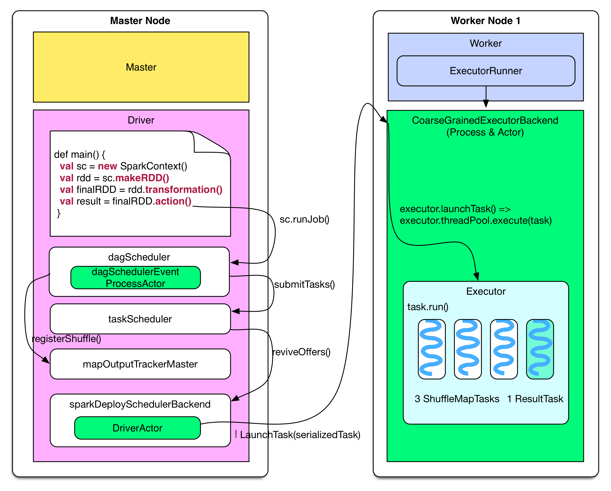
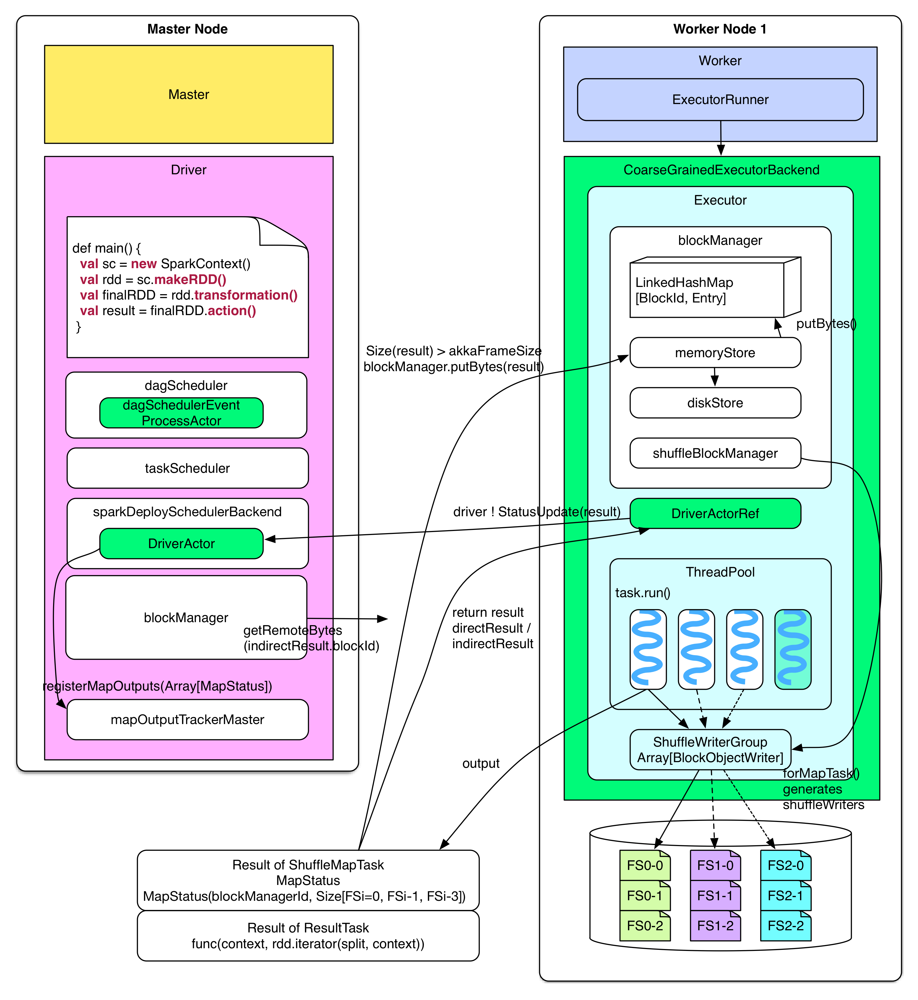
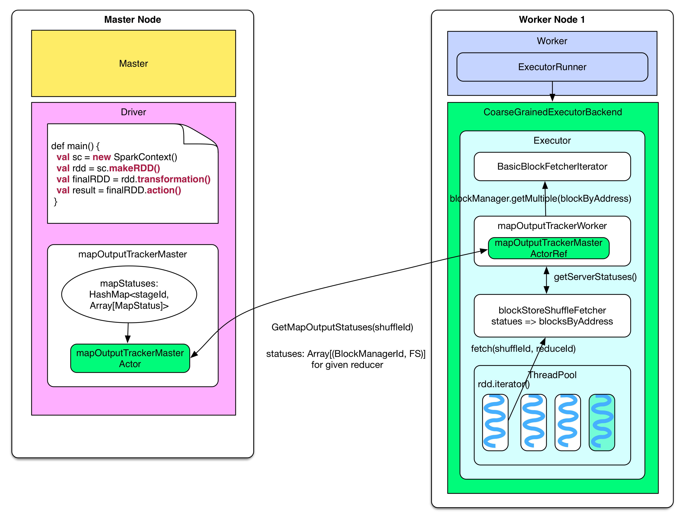

#	สถาปัตยกรรม

เราเคยคุยกันเรื่อง Spark Job กันมาแล้วในบทที่ 3 ในบทนี้เราจะคุยกันเกี่ยวกับเรื่องของ สถาปัตยกรรมและ Master, Worker, Driver, Executor ประสานงานกันอย่างไรจนกระทั้งทำงานเสร็จเรียบร้อย

>  จะดูแผนภาพโดยไม่ดูโค้ดเลยก็ได้ไม่ต้องซีเรียส


## Deployment diagram

จากแผนภาพการดีพลอยในบทที่เป็นภาพรวม `overview` 


ต่อไปเราจะคุยกันถึงบางรายละเอียดเกี่ยวกับมัน

## การส่ง Job

แผนภาพด้านล่างจะอธิบายถึงว่าโปรแกรมไดรว์เวอร์ (บนโหนด Master) สร้าง Job และส่ง Job ไปยังโหนด Worker ได้อย่างไร?



ฝั่งไดรว์เวอร์จะมีพฤติกรรมการทำงานเหมือนกับโค้ดด้านล่างนี้

```scala
finalRDD.action()
=> sc.runJob()

// generate job, stages and tasks
=> dagScheduler.runJob()
=> dagScheduler.submitJob()
=>   dagSchedulerEventProcessActor ! JobSubmitted
=> dagSchedulerEventProcessActor.JobSubmitted()
=> dagScheduler.handleJobSubmitted()
=> finalStage = newStage()
=>   mapOutputTracker.registerShuffle(shuffleId, rdd.partitions.size)
=> dagScheduler.submitStage()
=>   missingStages = dagScheduler.getMissingParentStages()
=> dagScheduler.subMissingTasks(readyStage)

// add tasks to the taskScheduler
=> taskScheduler.submitTasks(new TaskSet(tasks))
=> fifoSchedulableBuilder.addTaskSetManager(taskSet)

// send tasks
=> sparkDeploySchedulerBackend.reviveOffers()
=> driverActor ! ReviveOffers
=> sparkDeploySchedulerBackend.makeOffers()
=> sparkDeploySchedulerBackend.launchTasks()
=> foreach task
      CoarseGrainedExecutorBackend(executorId) ! LaunchTask(serializedTask)
```

คำอธิบาย:

เมื่อโค้ดด้านบนต้องการทราบค่า (มี Action) โปรแกรมไดรว์เวอร์จะมีการสื่อสารระหว่างกันเกิดขึ้นหลายตัวเป็นขบวน เช่น การประมวลผล Job, Threads, Actors เป็นต้น

```scala
val sc = new SparkContext(sparkConf)
```
**บรรทัดนี้เป็นการกำหนดหน้าที่ของไดรว์เวอร์**

### Job logical plan

`transformation()` ในโปรแกรมไดรว์เวอร์จะสร้าง Chain การคำนวณ (ซีรีย์ของ RDD) ในแต่ละ RDD:
- ฟังก์ชัน `compute()` กำหนดการดำเนินการคำนวณของเรคอร์ดสำหรับพาร์ทิชันของมัน
- ฟังก์ชัน `getDependencies()` กำหนดเกี่ยวกับความสัมพันธ์ของการขึ้นต่อกันทั่วทั้งพาร์ทิชันของ RDD

### Job physical plan

แต่ละ `action()` จะกระตุ้นให้เกิด Job:
- ในระหว่างที่ `dagScheduler.runJob()` Stage จะถูกแยกและกำหนด (แยก Stage ตาม Shuffle ที่ได้อธิบายไปในบทก่อนหน้านี้แล้ว)
- ในระหว่างที่ `submitStage()`, `ResultTasks` และ `ShuffleMapTasks` จำเป็นต้องใช้ใน Stage ที่ถูกสร้างขึ้นมา จากนั้นจะถูกห่อไว้ใน `TaskSet` และส่งไปยัง `TaskScheduler` ถ้า `TaskSet` สามารถประมวลผลได้ Task จะถูกส่งไป `sparkDeploySchedulerBackend` ซึ่งจะกระจาย Task ออกไปทำงาน

### การกระจาย Task เพื่อประมวลผล

หลังจากที่ `sparkDeploySchedulerBackend` ได้รับ `TaskSet` ตัว `Driver Actor` จะส่ง Task ที่ถูก Serialize แล้วส่งไป `CoarseGrainedExecutorBackend Actor` บนโหนด Worker

## การรับ Job

หลังจากที่ได้รับ Task แล้วโหนด Worker จะทำงานดังนี้:

```scala
coarseGrainedExecutorBackend ! LaunchTask(serializedTask)
=> executor.launchTask()
=> executor.threadPool.execute(new TaskRunner(taskId, serializedTask))
```

**Executor จะห่อแต่ละ Task เข้าไปใน `taskRunner` และเลือก Thread ที่ว่างเพื่อให้ Task ทำงาน ตัวโปรเซสของ `CoarseGrainedExecutorBackend` เป็นได้แค่หนึ่ง Executor **

## การประมวลผล Task

แผนภาพด้านล่างแสดงถึงการประมวลผลของ Task เมื่อ Task ถูกรับโดยโหนด Worker และไดรว์เวอร์ประมวลผล Task จนกระทั่งได้ผลลัพธ์ออกมาได้อย่างไร



หลังจากที่ได้รับ Task ที่ถูก Serialize มาแล้ว Executor ก็จะทำการ Deserialize เพื่อแปลงกลับให้เป็น Task ปกติ และหลังจากนั้นจำสั่งให้ Task ทำงานเพื่อให้ได้ `directResult` ซึ่งจะสามารถส่งกลับไปที่ตัว Driver ได้ น่าสังเกตว่าข้อมูลที่ถูกห่อส่งมาจาก `Actor` ไม่สามารถมีขนาดใหญ่มากได้:

- ถ้าผลลัพธ์มีขนาดใหญ่มาก (เช่น หนึ่งค่าใน `groupByKey`) มันจะถูก Persist ในหน่วยความจำและฮาร์ดดิสก์และถูกจัดการโดย `blockManager` ตัวไดรว์เวอร์จะได้เฉพาะข้อมูล `indirectResult` ซึ่งมีข้อมูลตำแหน่งของแหล่งเก็บข้อมูลอยู่ด้วย และเมื่อมีความจำเป็นต้องใช้ตัวไดรว์เวอร์ก็จะดึงผ่าน HTTP ไป
- ถ้าผลลัพธ์ไม่ได้ใหญ่มาก (น้อยกว่า `spark.akka.frameSize = 10MB` มันจะถูกส่งโดยตรงไปที่ไดรว์เวอร์

**รายละเอียดบางอย่างเพิ่มเติมสำหรับ `blockManager`:**

เมื่อ `directResult > akka.frameSize` ตัว `memoryStorage` ของ `blockManager` จะสร้าง `LinkedHashMap` เพื่อเก็บข้อมูลที่มีขนาดน้อยกว่า `Runtime.getRuntime.maxMemory * spark.storage.memoryFraction` (ค่าเริ่มต้น 0.6) เอาไว้ในหน่วยความจำ แต่ถ้า `LinkedHashMap` ไม่เหลือพื้นที่ว่างพอสำหรับข้อมูลที่เข้ามาแล้ว ข้อมูลเหล่านั้นจะถูกส่งต่อไปยัง `diskStore` เพื่อเก็บข้อมูลลงในฮาร์ดดิสก์(ถ้า `storageLevel` ระบุ "disk" ไว้ด้วย)

```scala
In TaskRunner.run()
// deserialize task, run it and then send the result to 
=> coarseGrainedExecutorBackend.statusUpdate()
=> task = ser.deserialize(serializedTask)
=> value = task.run(taskId)
=> directResult = new DirectTaskResult(ser.serialize(value))
=> if( directResult.size() > akkaFrameSize() ) 
       indirectResult = blockManager.putBytes(taskId, directResult, MEMORY+DISK+SER)
   else
       return directResult
=> coarseGrainedExecutorBackend.statusUpdate(result)
=> driver ! StatusUpdate(executorId, taskId, result)
```
ผลลัพธ์ที่ได้มาจากการทำงานของ `ShuffleMapTask` และ  `ResultTask` นั้นแตกต่างกัน

- `ShuffleMapTask` จะสร้าง `MapStatus` ซึ่งประกอบไปด้ว 2 ส่วนคือ:
	- `BlockManagerId` ของ `BlockManager` ของ Task: (executorId + host, port, nettyPort）
	- ขนาดของแต่ละเอาท์พุทของ Task (`FileSegment`)

- `ResultTask` จะสร้างผลลัพธ์ของการประมวลผลโดยการเจาะจงฟังก์ชันในแต่ละพาร์ทิชัน เช่น ฟังก์ชันของ `count()` เป็นฟังก์ชันง่ายๆเพื่อนับค่าจำนวนของเรคอร์ดในพาร์ทิชันหนึ่งๆ เนื่องจากว่า `ShuffleMapTask` ต้องการใช้ `FileSegment` สำหรับเขียนข้อมูลลงดิสก์ แลเยมีความต้องการใช้ `OutputStream` ซึ่งเป็นตัวเขียนข้อมูลออก ตัวเขียนข้อมูลเหล่านี้ถูกสร้างและจัดการโดย `blockManager` ของ `shuffleBlockManager`

```scala
In task.run(taskId)
// if the task is ShuffleMapTask
=> shuffleMapTask.runTask(context)
=> shuffleWriterGroup = shuffleBlockManager.forMapTask(shuffleId, partitionId, numOutputSplits)
=> shuffleWriterGroup.writers(bucketId).write(rdd.iterator(split, context))
=> return MapStatus(blockManager.blockManagerId, Array[compressedSize(fileSegment)])

//If the task is ResultTask
=> return func(context, rdd.iterator(split, context))
```

ซีรีย์ของการดำเนินการข้างบนจะทำงานหลังจากที่ไดรว์เวอร์ได้รับผลลัพธของ Task มาแล้ว

`TaskScheduler` จะได้รับแจ้งว่า Task นั้นเสร็จเรียบร้อยแล้วผลลัพธ์ของมันจะถูกประมวลผล:
- ถ้ามันเป็น `indirectResult`, `BlockManager.getRemotedBytes()` จะถูกร้องขอเพื่อดึงข้อมูลจากผลลัพธ์จริงๆ
- ถ้ามันเป็น `ResultTask`, `ResultHandler()` จะร้องขอฝั่งไดรว์เวอร์ให้เกิดการคำนวณบนผลลัพธ์ (เช่น `count()` จะใช้ `sum` ดำเนินการกับทุกๆ `ResultTask`)
- ถ้ามันเป็น `MapStatus` ของ `ShuffleMapTask` แล้ว `MapStatus` จำสามารถเพิ่มเข้าใน `MapStatuses` ของ `MapOutputTrackerMaster` ซึ่งทำให้ง่ายกว่าในการเรียกข้อมูลในขณะที่ Reduce shuffle
- ถ้า Task ที่รับมาบนไดรว์เวอร์เป็น Task สุดท้ายของ Stage แล้ว Stage ต่อไปจะถูกส่งไปทำงาน แต่ถ้า Stage นั้นเป็น Stage สุดท้ายแล้ว `dagScheduler` จะแจ้งว่า Job ประมวลผลเสร็จแล้ว

```scala
After driver receives StatusUpdate(result)
=> taskScheduler.statusUpdate(taskId, state, result.value)
=> taskResultGetter.enqueueSuccessfulTask(taskSet, tid, result)
=> if result is IndirectResult
      serializedTaskResult = blockManager.getRemoteBytes(IndirectResult.blockId)
=> scheduler.handleSuccessfulTask(taskSetManager, tid, result)
=> taskSetManager.handleSuccessfulTask(tid, taskResult)
=> dagScheduler.taskEnded(result.value, result.accumUpdates)
=> dagSchedulerEventProcessActor ! CompletionEvent(result, accumUpdates)
=> dagScheduler.handleTaskCompletion(completion)
=> Accumulators.add(event.accumUpdates)

// If the finished task is ResultTask
=> if (job.numFinished == job.numPartitions) 
      listenerBus.post(SparkListenerJobEnd(job.jobId, JobSucceeded))
=> job.listener.taskSucceeded(outputId, result)
=>    jobWaiter.taskSucceeded(index, result)
=>    resultHandler(index, result)

// If the finished task is ShuffleMapTask
=> stage.addOutputLoc(smt.partitionId, status)
=> if (all tasks in current stage have finished)
      mapOutputTrackerMaster.registerMapOutputs(shuffleId, Array[MapStatus])
      mapStatuses.put(shuffleId, Array[MapStatus]() ++ statuses)
=> submitStage(stage)
```

## Shuffle read

ในย่อหน้าก่อนหน้านี้เราได้คุยกันถึงการทำ Task ว่าถูกประมวลผลและมีกระบวนการที่จะได้ผลลัพธ์มาอย่างไร ในตอนนี้เราจะคุยกันเรื่องว่าทำอย่างไร Reducer (Task ที่ต้องการ Shuffle) จึงจะได้รับข้อมูลอินพุท ส่วนของ Shuffle read ในท้ายบทนี้ก็ได้มีการคุยถึงกระบวนการของ Reducer ที่ทำกับข้อมูลอินพุทมาบ้างแล้ว

**ทำอย่างไร Reducer ถึงจะรู้ว่าข้อมูลที่ต้องไปดึงอยู่ตรงไหน?**



Reducer ต้องการทราบว่าโหนดในที่ `FileSegment` ถูกสร้างโดย `ShuffleMapTask` ของ Stage พ่อแม่ **ประเภทของข้อมูลที่จะส่งไปไดรว์เวอร์คือ `mapOutputTrackerMaster` เมื่อ `ShuffleMapTasl` ทำงานเสร็จข้อมูลจะถูกเก็บใน `mapStatuses: HashMp[stageId,Array[MapStatus]]`** หากให้ `stageId` เราก็จะได้ `Array[MapStatus]` ออกมาซึ่งในนั้นมีข้อมูลที่เกี่ยวกับ `FileSegment` ทีี่สร้างจาก `ShuffleMapTask` บรรจุอยู่ `Array(taskId)` จะมีข้อมูลตำแหน่ง (`blockManagerId`) และขนาดของแต่ละ `FileSegment` เก็บอยู่ 

เมื่อ Reducer ต้องการดึงข้อมูลอินพุท มันจะเริ่มจากการร้องขอ `blockStoreShuffleFetcher` เพื่อขอข้อมูลตำแหน่งของ `FileSegment` ต่อมา `blockStoreShuffleFetcher` จะเรียก `MapOutputTrackerWorker` บนโหนด Worker เพื่อทำงาน ตัว `MapOutputTrackerWorker` ใช้ `mapOutputTrackerMasterActorRef` เพื่อสื่อสารกับ `mapOutputTrackerMasterActor` ตามลำดับเพื่อรับ `MapStatus` กระบวนการ `blockStoreShuffleFetcher` จะประมวลผล `MapStatus` แล้วจะพบว่าที่ Reducer ต้องไปดึงข้อมูลของ `FileSegment` จากนั้นจะเก็บข้อมูลนี้ไว้ใน `blocksByAddress`. `blockStoreShuffleFetcher` จะเป็นตัวบอกให้ `basicBlockFetcherIterator` เป็นตัวดึงข้อมูล `FileSegment`

```scala
rdd.iterator()
=> rdd(e.g., ShuffledRDD/CoGroupedRDD).compute()
=> SparkEnv.get.shuffleFetcher.fetch(shuffledId, split.index, context, ser)
=> blockStoreShuffleFetcher.fetch(shuffleId, reduceId, context, serializer)
=> statuses = MapOutputTrackerWorker.getServerStatuses(shuffleId, reduceId)

=> blocksByAddress: Seq[(BlockManagerId, Seq[(BlockId, Long)])] = compute(statuses)
=> basicBlockFetcherIterator = blockManager.getMultiple(blocksByAddress, serializer)
=> itr = basicBlockFetcherIterator.flatMap(unpackBlock)
```


หลังจากที่ `basicBlockFecherIterator` ได้รับ Task ของการเรียกดูข้อมูลมันจะสร้าง `fetchRequest` **แต่ละ Request จะประกอบไปด้วย Task ที่จะดึงข้อมูล `FileSegment` จากหลายๆโหนด** ตามที่แผนภาพด้านบนแสดง เราทราบว่า `reducer-2` ต้องการดึง `FileSegment` (ย่อ: FS, แสดงด้วยสีขาว) จากโหนด Worker 3 โหนดการเข้าถึงข้อมูลระดับโกลบอลสามารถเข้าถึงและดึงข้อมูลได้ด้วย `blockByAddress`: 4 บล๊อคมาจาก `node 1`, 3 บล๊อคมาจาก `node 2` และ 4 บล๊อคมาจาก `node 3`

เพื่อที่จะเพิ่มความเร็วการดึงข้อมูลเราสามารถแบ่ง Task (`fetchRequest`) แบบโกลบอลให้เป็น Task แบบย่อยๆ ทำให้แต่ละ Task สามารถมีหลายๆ Thread เพื่อดึงข้อมูลได้ ซึ่ง Spark กำหนดค่าเริ่มต้นไว้ที่ Thread แบบขนาน 5 ตัวสำหรับแต่ละ Reducer (เท่ากับ Hadoop) เนื่องจากการดึงข้อมูลมาจะถูกบัฟเฟอร์ไว้ในหน่วยความจำดังนั้นในการดึงข้อมูลหนึ่งครั้งไม่สามารถมีขนาดได้สูงนัก (ไม่มากกว่า `spark.reducer.maxMbInFlight＝48MB`) **โปรดทราบว่า `48MB` เป็นค่าที่ใช้ร่วมกันระหว่าง 5 Thread** ดังนั้น Task ย่อยจะมีขนาดไม่เกิน `48MB / 5 = 9.6MB` จากแผนภาพ `node 1` เรามี `size(FS0-2) + size(FS1-2) < 9.6MB, แต่ size(FS0-2) + size(FS1-2) + size(FS2-2) > 9.6MB` ดังนั้นเราต้องแยกกันระหว่าง `t1-r2` และ `t2-r2` เพราพขนาดเกินจะได้ผลลัพธ์คือ 2 `fetchRequest` ที่ดึงข้อมูลมาจาก `node 1` **จะมี `fetchRequest` ที่ขนาดใหญ่กว่า 9.6MB ได้ไหม?** คำตอบคือได้ ถ้ามี `FileSegment` ที่มีขนาดใหญ่มากมันก็ยังต้องดึงด้วย Request เพียงตัวเดียว นอกจากนี้ถ้า Reducer ต้องการ `FileSegment` บางตัวที่มีอยู่แล้วในโหนดโลคอลมันก็จะอ่านที่โลคอลออกมา หลังจากจบ Shuffle read แล้วมันจะดึง `FileSegment` มา Deserialize แล้วส่งการวนซ้ำของเรคอร์ดไป `RDD.compute()`

```scala
In basicBlockFetcherIterator:

// generate the fetch requests
=> basicBlockFetcherIterator.initialize()
=> remoteRequests = splitLocalRemoteBlocks()
=> fetchRequests ++= Utils.randomize(remoteRequests)

// fetch remote blocks
=> sendRequest(fetchRequests.dequeue()) until Size(fetchRequests) > maxBytesInFlight
=> blockManager.connectionManager.sendMessageReliably(cmId, 
	   blockMessageArray.toBufferMessage)
=> fetchResults.put(new FetchResult(blockId, sizeMap(blockId)))
=> dataDeserialize(blockId, blockMessage.getData, serializer)

// fetch local blocks
=> getLocalBlocks() 
=> fetchResults.put(new FetchResult(id, 0, () => iter))
```
รายละเอียดบางส่วน:

**Reducer ส่ง `fetchRequest` ไปยังโหนดที่ต้องการได้อย่างไร? โหนดปลายทางประมวลผล `fetchRequest` ได้อย่างไร? อ่านและส่งกลับ `FileSegment` ไปยัง Reducer**


เมื่อ `RDD.iterator()` เจอ `ShuffleDependency`, `BasicBlockFetcherIterator` จะถูกเรียกใช้เพื่อดึงข้อมูล `FileSegment` โดย `BasicBlockFetcherIterator` จะใช้ `connectionManager` ของ `blockManager` เพื่อส่ง `fetchRequest` ไปยัง `connectionManager` บนโหนดอื่นๆ NIO ใช้สำหรับการติดต่อสื่อสารระหว่าง `connnectionManager` บนโหนดอื่น ยกตัวอย่างโหนด Worker `node 2` จะรับข้อความแล้วส่งต่อข้อความไปยัง `blockManager` ถัดมาก็ใช้  `diskStore` อ่าน `FileSegment` ตามที่ระบุคำร้องขอไว้ใน `fetchRequest` จากนั้นก็ส่งกลับผ่าน `connectionManager` และถ้าหากว่า `FileConsolidation` ถูกกำหนดไว้ `diskStore` จะต้องการตำแหน่งของ `blockId` ที่ได้รับจาก `shuffleBolockManager` ถ้า `FileSegment` มีขนาดไม่เกิน `spark.storage.memoryMapThreshold = 8KB` แล้ว `diskStore` จะวาง `FileSegment` ไว้ในหน่วยความจำในขณะที่กำลังอ่านข้อมูลอยู่ ไม่อย่างนั้นแล้วเมธอตใน `FileChannel` ของ `RandomAccessFile` ซึ่งจะ Mapping หน่วยความจำไว้ทำให้สามารถอ่าน `FileSegment` ขนาดใหญ่เข้ามาในหน่วยความจำได้

และเมื่อไหร่ที่ `BasicBlockFetcherIterator` ได้รับ Serialize ของ `FileSegment` จากโหนดอื่นแล้วมันจะทำการ Deserialize และส่งไปใน `fetchResults.Queue` มีข้อควรทราบอย่างหนึ่งก็คือ **`fetchResults.Queue` คล้ายกัน `softBuffer` ในรายละเอียดของบทที่เป็น Shuffle** ถ้า `FileSegment` ต้องการโดย `BasicBlockFetcherIterator` บนโหนดนั้นมันจะสามารถหาได้จาก `diskStore` ในโหนดนั้นและวางใน `fetchResult`, สุดท้ายแล้ว Reducer จะอ่านเรคอร์ดจาก `FileSegment` และประมวลผลมัน

```scala
After the blockManager receives the fetch request

=> connectionManager.receiveMessage(bufferMessage)
=> handleMessage(connectionManagerId, message, connection)

// invoke blockManagerWorker to read the block (FileSegment)
=> blockManagerWorker.onBlockMessageReceive()
=> blockManagerWorker.processBlockMessage(blockMessage)
=> buffer = blockManager.getLocalBytes(blockId)
=> buffer = diskStore.getBytes(blockId)
=> fileSegment = diskManager.getBlockLocation(blockId)
=> shuffleManager.getBlockLocation()
=> if(fileSegment < minMemoryMapBytes)
     buffer = ByteBuffer.allocate(fileSegment)
   else
     channel.map(MapMode.READ_ONLY, segment.offset, segment.length)
```

Reducer ทุกตัวจะมี `BasicBlockFetcherIterator` และ `BasicBlockFetcherIterator` แต่ละตัวจะสามารถถือข้อมูล `fetchResults` ได้ 48MB ในทางทฤษฏี และในขณะเดียวกัน `FileSegment` ใน `fetchResults` บางตัวอาจจะทำให้เต็ม 48MB ได้เลย

```scala
BasicBlockFetcherIterator.next()
=> result = results.task()
=> while (!fetchRequests.isEmpty &&
        (bytesInFlight == 0 || bytesInFlight + fetchRequests.front.size <= maxBytesInFlight)) {
        sendRequest(fetchRequests.dequeue())
      }
=> result.deserialize()
```

## การพูดคุย

ในเรื่องของการออกแบบสถาปัตยกรรม การใช้งาน และโมดูลเป็นส่ิงที่แยกจากกันเป็นอิสระได้อย่างดี `BlockManager` ถูกออกแบบมาอย่างดี แต่มันดูเหมือนจะถูกออกแบบมาสำหรับจัดการของหลายสิ่ง (บล๊อคข้อมูล, หน่วยความจำ, ดิสก์ และการติดต่อสื่อสารกันระหว่างเครือข่าย)

ในบทนี้คุยกันเรื่องว่าโมดูลในระบบของ Spark แต่ละส่วนติดต่อประสานงานกันอย่างไรเพื่อให้งานเสร็จ (Production, Submision, Execution, Result collection Result computation และ Shuffle) โค้ดจำนวนมากถูกวางไว้และแผนภาพจะนวนมากที่ถูกวาดขึ้น ซึ่งรายละเอียดจะแสดงในโค้ดถ้าหากต้องการดู

รายละเอียดของ `BlockManager` สามารถอ่านเพิ่มเติมได้จากบล๊อคภาษาจีนที่ [blog](http://jerryshao.me/architecture/2013/10/08/spark-storage-module-analysis/)