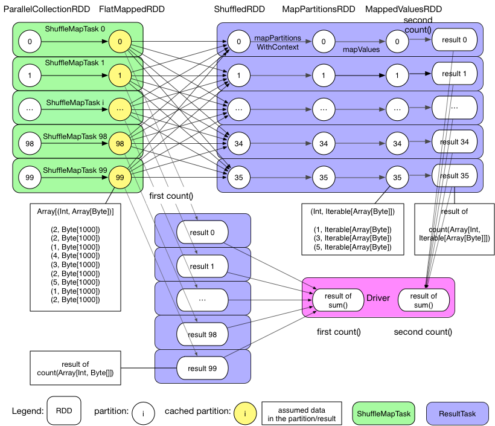
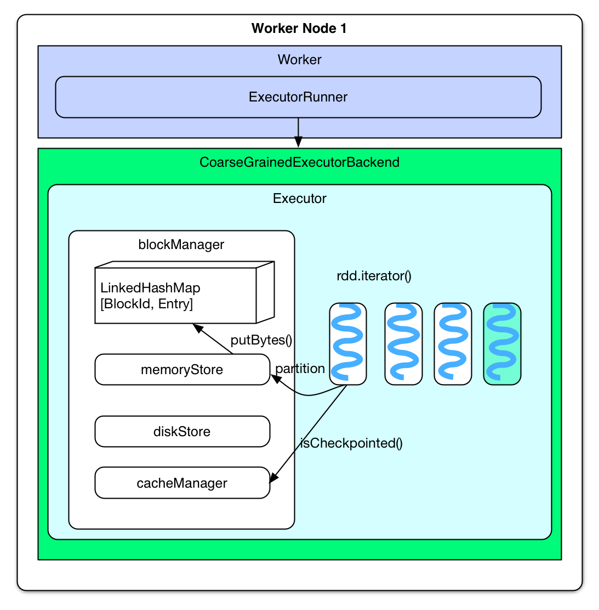

# cache และ checkpoint

`cache` (หรือ `persist`) เป็นฟีเจอร์ที่สำคัญของ Spark ซึ่งไม่มีใน Hadoop ฟีเจอร์นี้ทำให้ Spark มีความเร็วมากกว่าเพราะสามารถใช้เช็ตข้อมูลเดินซ้ำได้ เช่น Iterative algorithm ใน Machine Learning, การเรียกดูข้อมูลแบบมีปฏิสัมพันธ์ เป็นต้น ซึ่งแตกต่างกับ Hadoop MapReduce Job เนื่องจาก Sark มี Logical/Physical pan ที่สามารถขยายงานออกกว้างดังนั้น Chain ของการคำนวณจึงจึงยาวมากและใช้เวลาในการประมวลผล RDD นานมาก และหากเกิดข้อผิดพลาดในขณะที่ Task กำลังประมวลผลอยู่นั้นการประมวลผลทั้ง Chain ก็จะต้องเริ่มใหม่ ซึ่งส่วนนี้ถูกพิจารณาว่ามีข้อเสีย ดังนั้นจึงมี `checkpoint` กับ RDD เพื่อที่จะสามารถประมวลผลเริ่มต้นจาก `checkpoint` ได้โดยที่ไม่ต้องเริ่มประมวลผลทั้ง Chain ใหม่

## cache()

ลองกลับไปดูการทำ `GroupByTest` ในบทที่เป็นภาพรวม เราจะเห็นว่า `FlatMappedRDD` จะถูกแคชไว้ดังนั้น Job 1 (Job ถัดมา) สามารถเริ่มได้ที่ `FlatMappedRDD` นี้ได้เลย เนื่องจาก `cache()` ทำให้สามารถแบ่งปันข้อมูลกันใช้ระหว่าง Job ในแอพพลิเคชันเดียวกัน

Logical plan：

Physical plan：


**Q: RDD ประเภทไหนที่เราต้องแคชเอาไว้ ?**

พวก RDD ที่มีการประมวลผลซ้ำๆ และก็ไม่ใหญ่มาก

**Q: จะแคช RDD ได้อย่างไร ?**

แค่สั่ง `rdd.cache()` ในโปรแกรมไดรว์เวอร์ เมื่อ `rdd` ที่เข้าถึงได้จากผู้ใช้งานแล้ว เช่น RDD ที่ถูกสร้างโดย `transformation()` จะสามารถแคชจากผู้ใช้ได้ แต่บาง RDD ที่สร้างโดย Spark ผู้ใช้ไม่มาสารถเข้าถึงได้จึงไม่สามารถแคชโดยผู้ใช้ได้ เช่น `ShuffledRDD`, `MapPartitionsRDD` ขณะที่ทำงาน `reduceByKey()` เป็นต้น

**Q: Spark แคช RDD ได้อย่างไร ?**

เราสามารถลองเดาดูอย่างที่เราสังหรณ์ใจว่าเมื่อ Task ได้รับเรคอร์ดแรกของ RDD แล้วมันจะทดสอบว่า RDD สามารถแคชไว้ได้หรือเปล่า ถ้าสามารถทำได้เรคอร์ดและเรคอร์ดที่ตามมาจะถูกส่งไปยัง `memoryStore` ของ `blockManager` และถ้า `memoryStore` ไม่สามารถเก็บทุกเรคอร์ดไว้นหน่วยความจำได้ `diskStore` จะถูกใช้แทน

**การนำไปใช้นั้นคล้ายกับสิ่งเท่าเราเดาไว้ แต่มีบางส่วนที่แตกต่าง** Spark จะทดสอบว่า RDD สามารถแคชได้หรือเปล่าแค่ก่อนที่จะทำการประมวลผลพาร์ทิชันแรก และถ้า RDD สามารถแคชได้ พาร์ทิชันจะถูกประมวลผลแล้วแคชไว้ในหน่วยความจำ ซึ่ง `cache` ใช้หน่วยความจำเท่านั้น หากต้องการจะเขียนลงดิสก์จะเรียกใช้ `checkpoint`

หลังจากที่เรียกใช้งาน `rdd.cache()` แล้ว `rdd` จะกลายเป็น `persistRDD` ซึ่งมี `storageLevel` เป็น `MEMORY_ONLY` ตัว `persistRDD` จะบอก `driver` ว่ามันต้องการที่จะ Persist



แผนภาพด้านดนสามารถแสดงได้ในโค้ดนี้:
```scala
rdd.iterator()
=> SparkEnv.get.cacheManager.getOrCompute(thisRDD, split, context, storageLevel)
=> key = RDDBlockId(rdd.id, split.index)
=> blockManager.get(key)
=> computedValues = rdd.computeOrReadCheckpoint(split, context)
      if (isCheckpointed) firstParent[T].iterator(split, context)
      else compute(split, context)
=> elements = new ArrayBuffer[Any]
=> elements ++= computedValues
=> updatedBlocks = blockManager.put(key, elements, tellMaster = true)
```

เมื่อ `rdd.iterator()` ถูกเรียกใช้เพื่อประมวลผลในบางพาร์ทิชันของ `rdd` แล้ว `blockId` จะถูกใช้เพื่อกำหนดว่าพาร์ทิชันไหนจะถูกแคช เมื่อ `blockId` มีชนิดเป็น `RDDBlockId` ซึ่งจะแตกต่างกับชนิดของข้อมูลอื่นที่อยู่ใน `memoryStore` เช่น `result` ของ Task จากนั้นพาร์ทิชันใน `blockManager` จะถูกเช็คว่ามีการ Checkpoint แล้ว ถ้าเป็นเช่นนั้นแล้วเราก็จะสามารถพูดได้ว่า Task ถูกทำงานเรียบร้อยแล้วไม่ได้ต้องการทำการประมวลผลบนพาร์ทิชันนี้อีก `elements` ที่มีชนิด `ArrayBuffer` จะหยิบทุกเรคอร์ดของพาร์ทิชันมาจาก Checkpoint ถ้าไม่เป็นเช่นนั้นแล้วาร์ทิชันจะถูกประมวลผลก่อน แล้วทุกเรคอร์ดของมันจะถูกเก็บลงใน `elements` สุดท้ายแล้ว `elements` จะถูกส่งไปให้ `blockManager` เพื่อทำการแคช

`blockManager` จะเก็บ `elements` (partition) ลงใน `LinkedHashMap[BlockId, Entry]` ที่อยู่ใน `memoryStore` ถ้าขนาดของพาร์ทิชันใหญ่กว่าขนาดของ `memoryStore` จะจุได้ (60% ของขนาด Heap) จะคืนค่าว่าไม่สามารถที่จะถือข้อมูลนี้ไว้ได้ ถ้าขนาดไม่เกินมันจะทิ้งบางพาร์ทิชันของ RDD ที่เคยแคชไว้แล้วเพื่อที่จะทำให้มีที่ว่างพอสำหรับพาร์ทิชันใหม่ที่จะเข้ามา และถ้าพื้นที่มีมากพอพาร์ทิชันที่เข้ามาใหม่จะถูกเก็บลลงใน `LinkedHashMap` แต่ถ้ายังไม่พออีกระบบจะส่งกลับไปบอกว่าพื้นที่ว่างไม่พออีกครั้ง ข้อควรรู้สำหรับพาร์ทิชันเดิมที่ขึ้นกับ RDD ของพาร์ทิชันใหม่จะไม่ถูกทิ้ง ในอุดมคติแล้ว "first cached, first dropped"

**Q: จะอ่าน RDD ที่แคชไว้ยังไง ?**

เมื่อ RDD ที่ถูกแคชไว้แล้วต้องการที่จะประมวลผลใหม่อีกรอบ (ใน Job ถัดไป), Task จะอ่าน `blockManager` โดยตรงจาก `memoryStore`, เฉพาะตอนที่อยู่ระหว่างการประมวลผลของบางพาร์ทิชันของ RDD (โดยการเรียก `rdd.iterator()`) `blockManager` จะถูกเรียกถามว่ามีแคชของพาร์ทิชันหรือยัง ถ้ามีแล้วและอยู่ในโหนดโลคอลของมันเอง `blockManager.getLocal()` จะถูกเรียกเพื่ออ่านข้อมูลจาก `memoryStore` แต่ถ้าพาร์ทิชันถูกแคชบนโหนดอื่น `blockManager.getRemote()` จะถูกเรียก ดังแสดงด้านล่าง:


**ตำแหน่งของเหล่งเก็บข้อมูลพาร์ทิชันชันที่ถูกแคช:** ตัว `blockManager` ของโหนดซึ่งพาร์ทชันถูกแคชเก็บไว้อยู่จะแจ้งไปยัง `blockManagerMasterActor` บนโหนด Master วาสพาร์ทิชันถูกแคชอยู่ซึ่งข้อมูลถูกเก็บอยู่ในรูปของ `blockLocations: HashMap` ของ `blockMangerMasterActor` เมื่อ Task ต้องการใช้ RDD ที่แคชไว้มันจะส่ง `blockManagerMaster.getLocations(blockId)` เป็นคำร้องไปยังไดรว์เวอร์เพื่อจะขอตำแหน่งของพาร์ทิชัน จากนั้นไดรว์เวอร์จะมองหาใน `blockLocations` เพื่อส่งข้อมูลตำแหน่งกลับไป

**การพาร์ทิชันที่ถูกแคชไว้บนโหนดอื่น:** เมื่อ Task ได้รัยข้อมูลตำแหน่งของพาร์ทิชันที่ถูกแคชไว้แล้วว่าอยู่ตำแหน่งใดจากนั้นจะส่ง `getBlock(blockId)` เพื่อร้องขอไปยังโหนดปลายทางผ่าน `connectionManager` โหนดปลายทางก็จะรับและส่งกลับพาร์ทิชันที่ถูกแคชไว้แล้วจาก `memoryStore` ของ `blockManager` บนตัวมันเอง

## Checkpoint

**Q:  RDD ประเภทไหนที่ต้องการใช้ Checkpoint ?**

-	การประมวลผล Task ใช้เวลานาน
-	Chain ของการประมวลผลเป็นสายยาว
-	ขึ้นต่อหลาย RDD

ในความเป็นจริงแล้วการบันทึกข้อมูลเอาท์พุทจาก `ShuffleMapTask` บนโหนดโลคอลก็เป็นการ `checkpoint` แต่นั่นเป็นการใช้สำหรับข้อมูลที่เป็นข้อมูลเอาท์พุทของพาร์ทิชัน

**Q: เมื่อไหร่ที่จะ Checkpoint ?**

อย่างที่ได้พูดถึงข้างบนว่าทุกครั้งที่พาร์ทิชันที่ถูกประมวลผลแล้วต้องการที่จะแคชมันจะแคชลงไปในหน่วยความจำ แต่สำหรับ `checkpoint()` มันไม่ได้เป็นอย่างนั้น เพราะ Checkpoint ใช้วิธีรอจนกระทั่ง Job นั้นทำงานเสร็จก่อนถึงจะสร้าง Job ใหม่เพื่อมา Checkpoint **RDD ที่ต้องการ Checkpoint จะมีการประมวลผลของงานใหม่อีกครั้ง ดังนั้นจึงแนะนำให้สั่ง `rdd.cache()` เพื่อแคชข้อมูลเอาไว้ก่อนที่จะสั่ง `rdd.checkpoint()`** ในกรณีนี้งานที่ Job ที่สองจะไม่ประมวลผลซ้ำแต่จะหยิบจากที่เคยแคชไว้มาใช้ ซึ่งในความจริง Spark มีเมธอต `rdd.persist(StorageLevel.DISK_ONLY)` ให้ใช้เป็นลักษณะของการแคชลงไปบนดิสก์ (แทนหน่วยความจำ) แต่ชนิดของ `persist()` และ `checkpoint()` มีความแตกต่างกัน เราจะคุยเรื่องนี้กันทีหลัง


**Q: นำ Checkpoint ไปใช้ได้อย่างไร ?**

นี่คือขั้นตอนการนำไปใช้

RDD จะเป็น: [ เริ่มกำหนดค่า --> ทำเครื่องหมายว่าจะ Checkpoint --> ทำการ Checkpoint --> Checkpoint เสร็จ ]. ในขั้นตอนสุดท้าย RDD ก็จะถูก Checkpoint แล้ว

**เริ่มกำหนดค่า**

ในฝั่งของไดรว์เวอร์หลังจากที่ `rdd.checkpoint()` ถูกเรียกแล้ว RDD จะถูกจัดการโดย `RDDCheckpointData` ผู้ใช้สามารถตั้งค่าแหล่งเก็บข้อมูลชี้ไปที่ตำแหน่งที่ต้องให้เก็บไว้ได้ เช่น บน HDFS

**ทำเครื่องหมายว่าจะ Checkpoint**

หลังจากที่เริ่มกำหนดค่า `RDDCheckpointData` จะทำเครื่องหมาย RDD เป็น `MarkedForCheckpoint`

**ทำการ Checkpoint**

เมื่อ Job ประมวลผลเสร็จแล้ว `finalRdd.doCheckpoint()` จะถูกเรียกใช้ `finalRdd` จำสแกน Chain ของการประมวลผลย้อนกลับไป และเมื่อพบ RDD ที่ต้องการ Checkpoint แล้ว RDD จะถูกทำเครื่องหมาย `CheckpointingInProgress` จากนั้นจะตั้งค่าไฟล์ (สำหรับเขียนไปยัง HDFS) เช่น core-site.xml จะถูก Broadcast ไปยัง `blockManager` ของโหนด Worker อื่นๆ จากนั้น Job จะถูกเรียกเพื่อทำ Checkpoint ให้สำเร็จ

```scala
rdd.context.runJob(rdd, CheckpointRDD.writeToFile(path.toString, broadcastedConf))
```

**Checkpoint เสร็จ**

หลังจากที่ Job ทำงาน Checkpoint เสร็จแล้วมันจะลบความขึ้นต่อกันของ RDD และตั้งค่า RDD  ไปยัง Checkpoint จากนั้น **เพื่มการขึ้นต่อกันเสริมเข้าไปและตั้งค่าให้ RDD พ่อแม่มันเป็น `CheckpointRDD`** ตัว `CheckpointRDD` จะถูกใช้ในอนาคตเพื่อที่จะอ่านไฟล์ Checkpoint บนระบบไฟล์แล้วสร้างพาร์ทิชันของ RDD

อะไรคือสิ่งที่น่าสนใจ:

RDD สองตัวถูก Checkpoint บนโปรแกรมไดรว์เวอร์ แต่มีแค่ `result` (ในโค้ดด่านล่าง) เท่านั้นที่ Checkpoint ได้สำเร็จ ไม่แน่ใจว่าเป็น Bug หรือเพราะว่า RDD มันตามน้ำหรือจงใจให้เกิด Checkpoint กันแน่

```scala
val data1 = Array[(Int, Char)]((1, 'a'), (2, 'b'), (3, 'c'),
    (4, 'd'), (5, 'e'), (3, 'f'), (2, 'g'), (1, 'h'))
val pairs1 = sc.parallelize(data1, 3)

val data2 = Array[(Int, Char)]((1, 'A'), (2, 'B'), (3, 'C'), (4, 'D'))
val pairs2 = sc.parallelize(data2, 2)

pairs2.checkpoint

val result = pairs1.join(pairs2)
result.checkpoint
```

**Q: จะอ่าน RDD ที่ถูก Checkpoint ไว้อย่างไร ?**

`runJob()`  จะเรียกใช้ `finalRDD.partitions()` เพื่อกำหนดว่าจะมี Task เกิดขึ้นเท่าไหร่. `rdd.partitions()` จะตรวจสอบว่าถ้า RDD ถูก Checkpoint ผ่าน `RDDCheckpointData` ซึ่งจัดการ RDD ที่ถูก Checkpoint แล้ว, ถ้าใช่จะคืนค่าพาร์ทิชันของ RDD (`Array[Partition]`). เมื่อ `rdd.iterator()` ถูกเรียกใช้เพื่อประมวลผลพาร์ทิชันของ RDD, `computeOrReadCheckpoint(split: Partition)` ก็จะถูกเรียกด้วยเพื่อตรวจสอบว่า RDD ถูก Checkpoint แล้ว ถ้าใช่ `iterator()` ของ RDD พ่อแม่จะถูกเรียก (รูจักกันในชื่อ `CheckpointRDD.iterator()` จะถูกเรียก) `CheckpointRdd` จะอ่านไฟล์บนระบบไฟล์เพื่อที่จะสร้างพาร์ทิชันของ RDD **นั่นเป็นเคล็ดลับที่ว่าทำไม `CheckpointRDD` พ่อแม่จึงถูกเพิ่มเข้าไปใน RDD ที่ถูก Checkpoint ไว้แล้ว**


**Q: ข้อแตกต่างระหว่าง `cache` และ `checkpoint` ?**

นี่คือคำตอบที่มาจาก Tathagata Das:

มันมีความแตกต่างกันอย่างมากระหว่าง `cache` และ `checkpoint` เนื่องจากแคชนั้นจะสร้าง RDD และเก็บไว้ในหน่วยความจำ (และ/หรือดิสก์) แต่ Lineage (Chain ของการกระมวลผล) ของ RDD (มันคือลำดับของการดำเนินการบน RDD) จะถูกจำไว้ ดังนั้นถ้าโหนดล้มเหลวไปและทำให้บางส่วนของแคชหายไปมันสามารถที่จะคำนวณใหม่ได้ แต่อย่างไรก็ดี **Checkpoint จะบันทึกข้อมูลของ RDD ลงเป็นไฟล์ใน HDFS และจะลืม Lineage อย่างสมบูรณ์** ซึ่งอนุญาตให้ Lineage ซึ่งมีสายยาวถูกตัดและข้อมูลจะถูกบันทึกไว้ใน HDFS ซึ่งมีกลไกการทำสำเนาข้อมูลเพื่อป้องกันการล้มเหลวตามธรรมชาติของมันอยู่แล้ว

นอกจากนี้ `rdd.persist(StorageLevel.DISK_ONLY)` ก็มีความแตกต่างจาก Checkpoint ลองนึกถึงว่าในอดีตเราเคย Persist พาร์ทิชันของ RDD ไปยังดิสก์แต่ว่าพาร์ทิชันของมันถูกจัดการโดย `blockManager` ซึ่งเมื่อโปรแกรมไดรว์เวอร์ทำงานเสร็จแล้ว มันหมายความว่า `CoarseGrainedExecutorBackend` ก็จะหยุดการทำงาน `blockManager` ก็จะหยุดตามไปด้วย ทำให้ RDD ที่แคชไว้บนดิสก์ถูกทิ้งไป (ไฟล์ที่ถูกใช้โดย `blockManager` จะถูกลบทิ้ง) แต่ Checkpoint สามารถ Persist RDD ไว้บน HDFS หรือโลคอลไดเรกทอรี่ ถ้าหากเราไม่ลบมือเองมันก็จะอยู่ไปในที่เก็บแบบนั้นไปเรื่อยๆ ซึ่งสามารถเรียกใช้โดยโปรแกรมไดรว์เวอร์อื่นถัดไปได้

## การพูดคุย

เมื่อครั้งที่ Hadoop MapReduce ประมวลผล Job มันจะ Persist ข้อมูล (เขียนลงไปใน HDFS) ตอนท้ายของการประมวลผล Task ทุกๆ Task และทุกๆ Job เมื่อมีการประมวลผล Task จะสลับไปมาระหว่างหน่วยความจำและดิสก์. ปัญหาของ Hadoop ก็คือ Task ต้องการที่จำประมวลผลใหม่เมื่อมี Error เกิดขึ้น เช่น Shuffle ที่หยุดเมื่อ Error จะทำให้ข้อมูลที่ถูก Persist ลงบนดิสก์มีแค่ครึ่งเดียวทำให้เมื่อมีการ Shuffle ใหม่ก็ต้อง Persist ข้อมูลใหม่อีกครั้ง ซึ่ง Spark ได้เรียบในข้อนี้เนื่องจากหากเกิดการผิดพลาดขึ้นจะมีการอ่านข้อมูลจาก Checkpoint แต่ก็มีข้อเสียคือ Checkpoint ต้องการการประมวลผล Job ถึงสองครั้ง

## Example

```scala
package internals

import org.apache.spark.SparkContext
import org.apache.spark.SparkContext._
import org.apache.spark.SparkConf

object groupByKeyTest {

   def main(args: Array[String]) {
    val conf = new SparkConf().setAppName("GroupByKey").setMaster("local")
    val sc = new SparkContext(conf)
    sc.setCheckpointDir("/Users/xulijie/Documents/data/checkpoint")

	val data = Array[(Int, Char)]((1, 'a'), (2, 'b'),
		    						 (3, 'c'), (4, 'd'),
		    						 (5, 'e'), (3, 'f'),
		    						 (2, 'g'), (1, 'h')
		    						)
	val pairs = sc.parallelize(data, 3)

	pairs.checkpoint
	pairs.count

	val result = pairs.groupByKey(2)

	result.foreachWith(i => i)((x, i) => println("[PartitionIndex " + i + "] " + x))

	println(result.toDebugString)
   }
}
```
