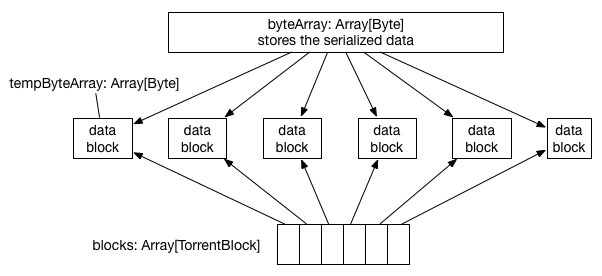

## Broadcast

เหมือนกับชื่อมันโดยปริยายไปเลย คือ Broadcast ที่หมายถึงการส่งข้อมูลจากโหนดหนึ่งไปยังโหนดอื่นทุกโหนดในคลัสเตอร์ มันมีประโยชน์มากในหลายสถานการณ์ ยกตัวอย่างเรามีตารางหนึ่งในไดรว์เวอร์แล้วโหนดอื่นทุกโหนดต้องการที่จะอ่านค่าจากตารางนั้น ถ้าใช้ Broadcast เราจะสามารถส่งตารางไปทุกโหนด เสร็จแล้ว Task ที่ทำงานอยู่บนโหนดนั้นๆ ก็สามารถที่อ่านค่าได้ภายในโหนดโลคอลของมันเอง จริงๆ แลวกลไกนี้มันยากและท้าทายที่จะนำไปใช้อย่างมีความน่าเชื่อถือและมีประสิทธิภาพ ในเอกสารของ Spark บอกว่า:

> ตัวแปร Broadcast อนุญาตให้นักพัฒนาโปรแกรมยังคงแคชตัวแปรแบบ**อ่านอย่างเดียว (Read-only)**ไว้ในแต่ละ**เครื่อง**มากกว่าที่จะส่งมันไปกับ **Task** ยกตัวอย่างที่สามารถใช้คุณสมบัตินี้ได้ เช่น การให้ทุกๆโหนดมีสำเนาของ**เซ็ตของข้อมูลขนาดใหญ่**ในขณะที่สามารถจัดการได้อย่างมีประสิทธิภาพ Spark ก็พยายามที่จะกระจายตัวแปร Broardcast อย่างมีประสิทธิภาพโดยใช้ขั้นตอนวิธีการ Broadcast ที่มี**ประสิทธิภาพ**เพื่อลดค่าใช้จ่ายของการติดต่อสื่อสาร

### ทำไมต้อง read-only?

นี่เป็นปัญหาเรื่อง Consistency ถ้าตัวแปร Broadcast สามารถที่จะเปลี่ยนแปลงค่าหรือ Mutated ได้แล้ว ถ้ามีการเปลี่ยนแปลงที่โหนดใดโหนดหนึ่งเราจะต้องอัพเดททุกๆโหนดด้วย และถ้าหลายๆโหรดต้องการอัพเดทสำเนาของตัวแปรที่อยู่กับตัวเองหละเราะจะทำอย่างไรเพื่อที่จะทำให้มันประสานเวลากันและอัพเดทได้ย่างอิสระ? ไหนจะปัญหา Fualt-tolerance ที่จะตามมาอีก เพื่อหลีกเลี่ยงปัญหาเหล่านี้ Spark จะสนับสนุนแค่การใช้ตัวแปร Broadcast แบบอ่านอย่างเดียวเท่านั้น

### ทำไม Brodcast ไปที่โหนดแทนที่จะเป็น Task?

เนื่องจากแต่ละ Task ทำงานภายใน Thread และทุกๆ Task ประมวลผลได้แค่กับแอพพลิเคชันของ Spark เดียวกันดังนั้นการทำสำเนา Broadcast ตัวเดียวไว้บนโหนด (Executor) สามารถแบ่งปันกันใช้ได้กับทุก Task

### จะใช้ Broadcast ได้อย่างไร?

ตัวอย่างโปรแกรมไดรว์เวอร์:

```scala
val data = List(1, 2, 3, 4, 5, 6)
val bdata = sc.broadcast(data)

val rdd = sc.parallelize(1 to 6, 2)
val observedSizes = rdd.map(_ => bdata.value.size)
```

ไดรว์เวอร์สามารถใช้ `sc.broadcast()` เพื่อที่จะประกาศข้อมูลที่จะถูก Broadcast จากตัวอย่างข้างบน `bdata` คือ Broadcast ตัว `rdd.transformation(func)` จะใช้ `bdata` โดยตรงภายในฟังก์ชันเหมือนกับเป็นตัวแปรโลคอลของมันเอง

### Broadcast นำไปใช้งานด้อย่างไร?

การดำเนินงานของหลังจากการ Broadcast ไปแล้วน่าสนใจมาก

#### การกระจาย Metadata ของตัวแปร Broadcast

ไดรว์เวอร์จะสร้างโลคอลไดเรกทอรี่เพื่อที่จะเก็ยข้อมูลที่ได้มาจากการ Broadcast และเรียกใช้ `HttpServer` เพื่อเข้าใช้งานไดเรกทอรี่นี้ โดยข้อมูลจะเขียนลงไปในไดเรกเทอรี่นี้จริงๆเมื่อ Broadcast มีการเรียกใช้ (`val bdata = sc.broadcast(data)`) ในขณะเดียวกันข้อมูลก็ถูกเขียนไปที่ไดรว์เวอร์ในส่วนของ `blockManager` ด้วยโดยกำหนดระดับของ `StorageLevel` เป็นหน่วยความจำ + ดิสก์. Block Manager จะจัดสรร `blockId` (ด้วยชนิด `BroadcastBlockId`) สำหรับข้อมูลและเมื่อฟังก์ชันการแปลงใช้ตัวแปร Broadcast ตัว `submitTask()` ของไดรว์เวอร์จะ Serialize ข้อมูล Metadata ของมัน แล้วจึงส่ง Matadata ที่ Serialize พร้อมกับฟังก์ชันที่ถูก Serialize ไปทุกโหนด. ระบบ Akka มีการกำหนดขนาดของข้อความให้มีขนาดจำกัด ทำให้เราไม่สามารถที่จะส่งข้อมูลจริงๆไปได้ในการ Broadcast

> ทำไมไดรว์เวอร์ต้องมีการเก็บข้อมูลไว้ทั้งในโลคอลไดเรกทอรี่และ Block manager? การที่เก็บข้อมูลไว้ในโลคอลไดเรกทอรี่ใช้สำหรับ `HttpServer` และการเก็บข้อมูลไว้ใน Block Manager นั้นสะดวกกว่าสำหรับการใช้ข้อมูลภายในโปรแกรมไดรว์เวอร์

**แล้วเมื่อไหร่ที่ข้อมูลจริงๆจะถูก Broadcast** เมื่อ Executor ได้ Deserialize Task ที่ได้รับมาและมันจะได้ Metadata ของตัวแปร Broadcast มาด้วยในรูปแบบของวัตถุ `Broadcast` จากนั้นแล้วจะเรียกเมธอต `readObject()` ของวัตถุ Metadata (ตัวแปร `bdata`) ในเมธอตนี้จะมีการตรวจสอบก่อนเป็นอันดับแรกว่าใน Block manager ของตัวมันเองมีสำเนาอยู่แล้วหรือเปล่า ถ้าไม่มีมันถึงจะดึงมาจากไดรว์เวอร์มาเก็บไว้ที่ Block manager สำหรับการใช้งานที่จะตามมา
 
Spark มีการดำเนินงานในการดึงข้อมูลอยู่ 2 แบบที่แตกต่างกัน

#### HttpBroadcast

วิธีการนี้จะดึงข้อมูลผ่านทางโพรโตคอลการเชื่อมต่อ HTTP ระหว่าง Executor และไดรว์เวอร์

ไดรว์เวอร์จะสร้างวัตถุของ `HttpBroadcast` ขึ้นมาเป็นเพื่อเก็บข้อมูลที่จะ Broadcast ไว้ใน Block manager ของไดรว์เวอร์ ในขณะเดียวกันข้อมูลจะถูกเขียนลงในโลคอลดิสก์ที่เป็นไดเรกทอรี่อย่างที่เคยอธิบายไว้ก่อนหน้านี้แล้ว ยกตัวอย่างชื่อของไดเรกทอรี่ เช่น `/var/folders/87/grpn1_fn4xq5wdqmxk31v0l00000gp/T/spark-6233b09c-3c72-4a4d-832b-6c0791d0eb9c/broadcast_0`

> ไดรว์เวอร์และ Executor จะสร้างวัตถุ `broadcastManager` ในระยะเริ่มต้น และไดเรกทอรี่จะถูกสร้างโดยการสั่งเมธอต `HttpBroadcast.initialize()` ซึ่งเมธอตนี้ก็จะสั่งให้ HTTP server ทำงานด้วย

การดึงข้อมูลที่เป็นข้อมูจริงๆนั้นเกิดขึ้นจากการส่งผ่านข้อมูลระหว่างโหนดสองโหนดผ่านการเชื่อมต่อแบบโปรโตคอล HTTP

ปัญหาก็คือ `HttpBroadcast` มีข้อจำกัดเรื่องคอขวดของเครือข่ายในโหนดที่ทำงานเป็นไดรว์เวอร์เนื่องจากมันต้องส่งข้อมูลไปยังโหนดอื่นทุกๆโหนดในเวลาเดียวกัน

#### TorrentBroadcast

เพื่อที่จะแก้ปัญหาคอขวดที่เกิดกับระบบเครือข่ายของไดรว์เวอร์ใน `HttpBroadcast` ดังนั้น Spark จึงได้มีการนำเสนอวิธี Broadcast แบบใหม่ที่ชื่อว่า `TorrentBroadcast` ซึ่งได้รับแรงบัลดาลใจมาจาก BitTorrent หลักการง่ายของวิธีการนี้ก็คือจะเอาข้อมูลที่ต้องการ Broadcast หั่นเป็นบล๊อค และเมื่อ Executor ตัวไหนได้รับข้อมูลบล๊อคนั้นแล้วจะสามารถทำตัวเป็นแหล่งข้อมูลให้คนอื่นต่อได้

ไม่เหมือนกับการโอนถ่ายข้อมูลใน `HttpBroadcast` ตัว `TorrentBroadcast` จะใช้ `blockManager.getRemote() => NIO ConnectionManager` เพื่อทำงานและการรับ-ส่งข้อมูลจริงๆจะคล้ายกันอย่างมากกับการแคช RDD ที่เราคุยจะกันในบทสุดท้ายนี้ (ดูแผนภาพใน [CacheAndCheckpoint](https://github.com/JerryLead/SparkInternals/blob/master/markdown/6-CacheAndCheckpoint.md)).

รายละเอียดบางอย่างใน `TorrentBroadcast`:



#### Driver

ไดรว์เวอร์จะ Serialize ข้อมูลให้อยู่ในรูปของ `ByteArray` และตัดออกจากกันตามขนาดของ `BLOCK_SIZE` (กำหนดโดย `spark.broadcast.blockSize = 4MB`) เป็นบล๊อค หลังจากที่จัด `ByteArray` แล้วตัวเดิมมันก็ยังจะค้าางอยู่ชั่วคราวดังนั้นเราจะมี 2 สำเนาของข้อมูลอยู่ในหน่วยความจำ

หลังจากที่เราตัดแบ่งแล้วข้อมูลบางส่วนที่เกี่ยวกับบล๊อค (เรียกว่า Metadata) จะถูกเก็บไว้ใน Block manager ของไดรว์เวอร์ที่ระดับการเก็บเป็นหน่วยความจำ + ดิสก์ ซึ่งพอถึงตอนนี้ `blockManagerMaster` จะแจ้งว่า Metadata ถูกเก็บเรียบร้อยแล้ว **ขั้นตอนนี้สำคัญมากเนื่องจาก `blockManagerMaster` สามารถถูกเข้าถึงได้จากทุกๆ Executor นั่นหมายความว่าบล๊อคของ Metadata จะกลายเป็นข้อมูลโกลบอลของคลัสเตอร์**

ไดรว์เวอร์จะจบการทำงานของมันโดยเก็บบล๊อคข้แมูลที่อยู่ภายใช้ Block manager ไว้ในแหล่งเก็บข้อมูลทางกายภาพ

#### Executor

เมื่อได้รับ Task ที่ Serialize มาแล้ว Executor จะทำการ Deserialize กลับเป็นอันดับแรกซึ่งการ Deserialize ก็รวมไปถึง Metadata ที่ Broadcast มาแล้ว ถ้ามีประเภทเป็น `TorrentBroadcast` แล้วมันจะถูกเรียกเมธอต `TorrentBroadcast.readObject()` คล้ายกับขั้นตอนที่เคยได้กล่าวถึงในด้านบน จากนั้น Block manager ที่อยู่โลคอลจะตรวจสอบดูก่อนว่ามีบล๊อคข้อมูลไหนที่ถูกดึงมาอยู่ในเครื่องอยู่แล้ว ถ้าไม่มี Executor จะถามไปที่ `blockManagerMaster` เพื่อขอ Metadata ของบล๊อคข้อมูลแล้วหลังจากนั้นกระบวน BitTorrent จึงจะถูกเริ่มเพื่อดึงบล๊อคข้อมูล

**กระบวนการ BitTorrent:** ตัว `arrayOfBlocks = new Array[TorrentBlock](totalBlocks)` จะถูกจัดสรรบนโลคอลโหนดเพื่อใช้เก็บข้อมูลที่ถูกดึงมา แล้ว `TorrentBlock` จะห่อบล๊อคข้อมูลไว้. ลำดับของการดึงข้อมูลนั้นจะเป็นแบบสุ่ม ยกตัวอย่าง เช่น ถ้ามี 5 บล๊อคมันอาจจะเป็น 3-1-2-4-5 ก็ได้ แล้วจากนั้น Executor จะเริ่มดึงบล๊อคข้อมูลทีละตัว: `blockManager` บนโลคอล => `connectionManager` บนโลคอล => cutor ของเครื่องอื่น => ข้อมูล.  **การดึงบล๊อคข้อมูลแต่ละครั้งจะถูกเก็บใว้ใต้ Block manager และ `blockManagerMaster` ของไดรว์เวอร์จะแจ้งว่าบล๊อคข้อมูลถูกดึงสำเร็จแล้ว** อย่างที่คิดไว้เลยก็คือขั้นตอนนี้เป็นขั้นตอนที่สำคัญเพราะว่าในตอนนี้ทุกๆโหนดในคลัสเตอร์จะรู้ว่ามีแหล่งข้อมูลที่ใหม่สำหรับบล๊อคข้อมูล ถ้าโหนดอื่นต้องการดึงบล๊อคข้อมูลเดียวกันนี้มันจะสุ่มว่าจะเลือกดึงจากที่ไหน ถ้าบล๊อคข้อมูลที่จะถูกดึงมีจำนวนมากการกระจายด้วยวิธีนี้จะช่วยให้กลไกการ Broadcast เร็วขึ้น ถ้าจะให้เห็นภาพมากขึ้นลองอ่านเรื่อง BitTorrent บน [wikipedia](http://zh.wikipedia.org/wiki/BitTorrent_(%E5%8D%8F%E8%AE%AE)).

เมื่อบล๊อคข้อมูลทุกบล๊อคถูกดึงมาไว้ที่โหนดโลคอลแล้ว `Array[Byte]` ที่มีขนาดใหญ่จะถูกจัดสรรเพื่อสร้างข้อมูลที่ Broadcast มาขึ้นมาใหม่จากบล๊อคข้อมูลย่อยๆถูกถูกดึงมา สุดท้ายแล้ว Array นี้ก็จะถูก Deserialize และเก็บอยู่ภายใต้ Block manager ของโหนดโลคอล โปรดทราบว่าเมืื่อเรามีตัวแปร Broadcast ใน Block manager บนโหนดโลคอลแล้วเราสามารถลบบล๊อคของข้อมูลที่ถูกดึงมาได้อย่างปลอดภัย (ซึ่งก็ถูกเก็บอยู่ใน Block manager บนโหนดโลคอลเช่นเดียวกัน)

คำถามอักอย่างหนึ่งก็คือ: แล้วเกี่ยวกับการ Broadcast RDD หล่ะ? จริงๆแล้วไม่มีอะไรแย่ๆเกิดขึ้นหรอก RDD จะถูกทราบค่าในแต่ละ Executor ดังนั้นแต่ละโหนดจะมีสำเนาผลลัพธ์ของมันเอง

## การพูดคุย

การใช้ตัวแปร Broadcast แบ่งกันข้อมูลเป็นคุณสมบัติที่มีประโยชน์ ใน Hadoop เราจะมี `DistributedCache` ซึ่งถูกใช้งานในหลายๆสถานการณ์ เช่น พารามิเตอร์ของ `-libjars` จะถูกส่งไปยังทุกโหนดโดยการใช้ `DistributedCache` อย่างไรก็ดี Hadoop จะ Broadcast ข้อมูลโดยการอัพโหลดไปยัง HDFS ก่อนและไม่มีกลไกในการแบ่งปันข้อมูลระหว่าง Task ในโหนดเดียวกัน ถ้าบางโหนดต้องการประมวลผลโดยใช้ 4 Mapper ใน Job เดียวกันแล้วตัวแปร Broadcast จำต้องถูกเก็บ 4 ครั้งในโหนดนั้น (หนึ่งสำเนาต่อไดเรกทอรีที่ Mapper ทำงาน) ข้อดีของวิธีการนี้คือไม่เกิดคอขวดของระบบเนื่องจาก HDFS นั้นมีการตัดส่วนของข้อมูลออกเป็นบล๊อคและกระจายตัวทั่วทั้งตลัสเตอร์อยู่แล้ว

สำรับ Spark นั้น Broadcast จะใส่ใจเกี่ยวกับการส่งข้อมูลไปทุกโหนดและปล่อยให้ Task ในโหนดเดียวกันนั้นมีการแบ่งปันข้อมูลกัน ใน Spark มี Blog manager ที่จะช่วยแก้ไขปัญหาเรื่องการแบ่งปันข้อมูลระว่าง Task ในโหนดเดียวกัน การเก็บข้อมูลไว้ใน Block manager บนโหนดโลคอลโดยการใช้ระดับการเก็บข้อมูลแบบหน่วยความจำ + ดิสก์ จะรับร้องได้ว่าทุก Task บนโหนดสามารถที่จะเข้าถึงหน่วยความจำที่แบ่งปันกันนี้ได้ ซึ่งการทำแบบนี้สามารถช่วยเลี่ยงการเก็บข้อมูลที่มีความซ้ำซ้อน Spark มีการดำเนินการ Broadcast อยู่ 2 วิธีก็คือ `HttpBroadcast` ซึ่งมีคอขวดอยู่กับโหนดไดรว์เวอร์ และ `TorrentBroadcast` ซึ่งเป็นการแก้ปัญหาโดยใช้วิธีการของ BitTorrent ที่จะช้าในตอนแรกแต่เมื่อได้มัการดึงข้อมูลไปกระจายตาม Executor ตัวอื่นๆแล้วก็จะเร็วขึ้นและกระบวนการสร้างใหม่ของข้อมูลจากบล๊อคข้อมูลต้องการพื้นที่บนหน่วยความจำเพิ่มมากขึ้น

จริงๆแล้ว Spark มีการทดลองใช้ทางเลือกอื่นคือ `TreeBroadcast` ในรายละเอียดเชิงเทคนิคดูได้ที่: [Performance and Scalability of Broadcast in Spark](http://www.cs.berkeley.edu/~agearh/cs267.sp10/files/mosharaf-spark-bc-report-spring10.pdf).

ในความคิดเห็นของผู้เขียนคุณสมบัติ Broadcast นี้สามารถดำเนินการโดยใช้โปรโตคอลแบบ Multicast ได้ แต่เนื่องจาก Multicast มาจากพื้นฐานของ UDP ดังนั้นเราจึงต้องการกลไกที่มีความน่าเชื่อถือในระดับแอพพลิเคชันเลเยอร์